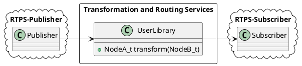
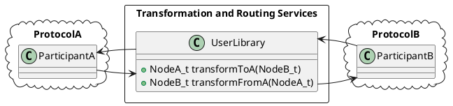

# eProsima Transformation and Routing Services

<!--  -->

*eProsima Transformation and Routing Services* is a library and an utility based on *Fast RTPS* for making communication bridges between different systems, services and protocols. With the *Transformation and Routing Services* the user can create parametric communication bridges between applications. At the same time, it is able to perform some transformations over the messages such as customized routing, mapping between input and output attributes or data modification.

Some of the possibilities offered by the *Transformation and Routing Services* are:

-   Connections for jumping from topics which are running on different domains.
-   Adapters for mapping the attributes from types with different IDL definitions.
-   User-defined operations over the circulating messages.
-   Communication with others environments, as *ROS2*.

#### Installation

Before compiling *eProsima Transformation and Routing Services* you need to have installed *Fast RTPS* as described in its [documentation ](http://eprosima-fast-rtps.readthedocs.io/en/latest/binaries.html>). For cloning this project execute:

    $ git clone https://github.com/eProsima/routing-service

Now, for compiling, if you are on Linux execute:

    $ mkdir build && cd build
    $ cmake ..
    $ make

If you are on Windows choose your version of Visual Studio:

    > mkdir build && cd build
    > cmake ..  -G "Visual Studio 14 2015 Win64"
    > cmake --build .

### Steps to allow other protocols

There are two kind of libraries that the user must implement:

**Bridge Library**: This libraries (one for unidirectional, two for bidirectional bridges) must export *createBridge* function as defined in the *resource/templatebridgelib.cpp* file:

	extern "C" RSBridge* USER_LIB_EXPORT createBridge(tinyxml2::XMLElement *bridge_element)
	
This function must return a pointer to an instance of a derived class of RSBridge, or nullptr if failed. 
TRSS will deallocate this object from memory when the bridge is stopped.

**Tranformation Library**: This library must implement transformation functions for the received data.
The *Bridge Libraries* will load and call this function, so the name of the functions can be customized.
There is a prototype in *resource/templatelib.cpp*:

	extern "C" void USER_LIB_EXPORT transform(
		SerializedPayload_t *serialized_input, 
		SerializedPayload_t *serialized_output)

For both types of libraries, there are examples in the *examples* folder and *src/RTPS*.

May be needed to generate data types from IDL files to communicate with *Fast-RTPS*.

*Transformation and Routing Services* will load the *Bridge Libraries* that will apply the transform function of the *Transformation Library* to the data received in its subscriber and write the result with its publisher, for each bridge.

The **config.xml** file must be addapted to each protocol. **RSManager** will parse the correspond node tree depending each protocol, defined in the *Bridge Libraries*, that knows how to setup each node with the information provided by the xml node.

#### Configuration options in **config.xml**

	<!-- Complete <bridge> node will be sent to each bridge_library to be parsed by itself. -->
	<rs>
		<!-- Generic bridges -->
		<bridge>
			<bridge_type>unidirectional</bridge_type>
			<subscriber> <!-- subscriber node may change depending of bridge_library implementation -->
				<!-- CUSTOM subscriber parameters -->
			</subscriber>
			<publisher> <!-- publisher node may change depending of bridge_library implementation -->
				<!-- CUSTOM publisher parameters -->
			</publisher>
			<transformation>/path/to/transformation/library</transformation> <!-- must define transform function -->
			<bridge_library>/path/to/bridge/library</bridge_library> <!-- must load tranform function as well -->
		</bridge>
		<bridge>
			<bridge_type>bidirectional</bridge_type>
			<nodeA>
				<!-- CUSTOM nodeA parameters -->
			</nodeA>
			<nodeB>
				<!-- CUSTOM nodeB parameters -->
			</nodeB>
			<transformation>/path/to/transformation/library</transformation> <!-- must implement both ways. Bridge_library must know what functions to search -->
			<bridge_library_nodeA>/path/to/bridge/library_1</bridge_library_nodeA> <!-- nodeA -> nodeB logic -->
			<bridge_library_nodeB>/path/to/bridge/library_2</bridge_library_nodeB> <!-- nodeB -> nodeA logic -->
		</bridge>
	</rs>

In the example *config.xml* above there are defined the two possible types of bridges.

The first bridge type is **unidirectional**. This bridge allows to communicate different applications that are based on RTPS protocol. In this case each node must be define by their role, **subscriber** or **publisher**:

- **Subscriber** refers to the endpoint that must *subscribe* in our bridge, in other words, the receiver of data of the bridge.

- **Publisher** refers to the endpoint that will *publish* the transformed data.

If you don't specify any bridge library the system will try to load the default *librsrtpsbridgelib.so* (and a warning will be shown at runtime).
This bridge library expects exactly *publisher* and *subscriber* nodes, and we recommend keep this pattern, but another bridge library implementation may define its own node names.

The second type is **bidirectional**. This bridges allows to propagate changes between two protocols. Each node can be identified by the definition of its bridge libraries, but we recommend to name them by their protocol.
As in unidirectional case, you can specify any needed parameter for each node by your bridge libraries. The convention of names for the transformation library is responsability of the developer.
It is mandatory to use **bridge_library_nodeA** and **bridge_library_nodeB** for each bridge library.

A concrete implementation of a **bidirectional** bridge can be found in the example of *TIS NGSIv2* bridge libraries (*librsrtpsngsiv2bridgelib.so* and *libngsiv2rtpsbridge.so*) on [**FIROS2**](https://github.com/eProsima/firos2).
These libraries look for *transformFromNGSIv2* and *transformToNGSIv2* functions in the transformation library.