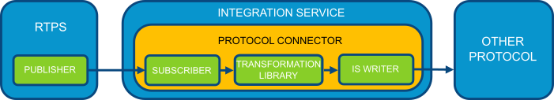

# eProsima Integration Service


*eProsima Integration Service* is a library based on *Fast RTPS* for creating parameterized
communication bridges between different systems, services and protocols.
It is also able to perform transformations over the messages such as customized routing and
mapping between input and output attributes or data modification.

The main features of *Integration Service* are:

-   Connects two different domains.
-   Mapping between different data types.
-   User-defined operations over the received messages.
-   Communication with others environments, like *ROS2*.


<p align="center">  </p>

<hr></hr>

### **Table Of Contents**

[Installation](#installation)

[Usage](#usage)

[Example application](#example-application)

[Documentation](#documentation)

[Getting Help](#getting-help)

<hr></hr>

### **Installation**

Before compiling *eProsima Integration Service* you need to have installed *Fast RTPS* as described in its [documentation](http://eprosima-fast-rtps.readthedocs.io/en/latest/binaries.html). You can use *Fast RTPS*
as third party too, adding `-DTHIRDPARTY=ON` in the cmake command.

To clone this project, just execute:

```bash
    $ git clone --recursive https://github.com/eProsima/integration-service
```

Now, for compiling, if you are on Linux you must execute:

```bash
    $ mkdir build && cd build
    $ cmake ..
    $ make
```

If you are on Windows you must choose a version of Visual Studio:

```bash
    > mkdir build && cd build
    > cmake ..  -G "Visual Studio 14 2015 Win64"
    > cmake --build .
```

If you want to compile *eProsima Integration Service* without an installed version of *Fast RTPS* you can add
`-DTHIRDPARTY=ON` parameter that downloads it as a third party library. If you prefer to use an already installed
*Fast RTPS*, remove that parameter.

If you are on Linux you must execute:

```bash
    $ mkdir build && cd build
    $ cmake -DTHIRDPARTY=ON ..
    $ make
```

If you are on Windows you must choose your version of Visual Studio:

```bash
    > mkdir build && cd build
    > cmake ..  -G "Visual Studio 14 2015 Win64" -DTHIRDPARTY=ON
    > cmake --build .
```

<hr></hr>

### **Usage**

Once installed you can execute *Integration Service* from your terminal. It receives an unique *XML configuration
file* as parameter.

```bash
    $ integration_service config.xml
```

That *XML configuration file* is needed by *Integration Service* to create all the needed components to do its job.
You should read the [documentation](https://integration-services.readthedocs.io/en/latest/configuration.html)
to know more about how to configure *Integration Service*.

### **Example application**

We will use
[domain_change](<https://github.com/eProsima/Integration-Service/tree/master/examples/domain_change>) as example.
In this example, we have generated a *Fast RTPS* example application using
[FastRTPSGen](https://eprosima-fast-rtps.readthedocs.io/en/latest/geninfo.html) and then configured
the publisher participant in domain **0**, and the subscriber participant in domain **5**.
This means that if a subscriber and a publisher are executed, there will be no communication between them,
even having the same topic and type.

Executing the *Integration Service* will create a bridge between the publisher (as a writer) and the subscriber
(as a reader), and communicate both applications.
The config file [config.xml](<https://github.com/eProsima/Integration-Service/tree/master/examples/domain_change/config.xml>),
provided in this example, defines a connector like this.

```xml
    <connector name="domain_change">
        <reader participant_profile="domain0" subscriber_profile="is_subscriber"/>
        <writer participant_profile="domain5" publisher_profile="is_publisher"/>
    </connector>
```

To execute the example properly, we must first compile the example itself, from the [domain_change example location](<https://github.com/eProsima/Integration-Service/tree/master/examples/domain_change>)

Linux:

```bash
    $ mkdir build
    $ cd build
    $ cmake ..
    $ make
```

Windows:

```bash
    > mkdir build
    > cd build
    > cmake -G "Visual Studio 14 2015 Win64" ..
    > cmake --build .
```

The compilation will generate an example application named DomainChange in the build directory.
When we execute DomainChange as a publisher, it will create its participant in domain 0.
If we launch DomainChange as a subscriber, it will create its participant in domain 5 instead.

Now, we must launch DomainChange in both setups:

```bash
    $ ./DomainChange publisher
```

And in another terminal:

```bash
    $ ./DomainChange subscriber
```

As both instances are bound to different domains, the applications will not communicate.
But once we launch IS with the config.xml that comes with the example,
both DomainChange instances will begin to communicate.

In another terminal:

```bash
    $ cd <path_to_is_source>/examples/domain_change
    $ integration_service config.xml
```

<hr></hr>

### **Documentation**

You can access the documentation online, which is hosted on
[Read the Docs](https://integration-services.readthedocs.io).

<hr></hr>

### **Getting Help**

If you need support you can reach us by mail at `support@eProsima.com` or by phone at `+34 91 804 34 48`.
