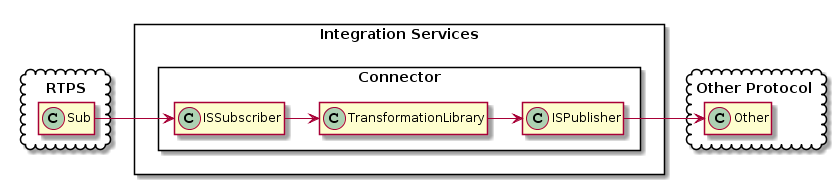

# eProsima Integration Services


*eProsima Integration Services* is a library and an utility based on *Fast RTPS* for making communication bridges between different systems, services and protocols. With *Integration Services* the user can create parameterized communication bridges between applications. At the same time, it is able to perform some transformations over the messages such as customized routing, mapping between input and output attributes or data modification.

Some of the possibilities offered by *Integration Services* are:

-   Connections for jumping from topics which are running on different domains.
-   Adapters for mapping the attributes from types with different IDL definitions.
-   User-defined operations over the circulating messages.
-   Communication with others environments, as *ROS2*.

<p align="center">  </p>

<hr></hr>

#### Table Of Contents

[Installation](#installation)

[Documentation](#documentation)

[Getting Help](#getting-help)
<hr></hr>

#### Installation

Before compiling *eProsima Integration Services* you need to have installed *Fast RTPS* as described in its [documentation](http://eprosima-fast-rtps.readthedocs.io/en/latest/binaries.html). For cloning this project execute:

```bash
    $ git clone --recursive https://github.com/eProsima/integration-services
```

Now, for compiling, if you are on Linux execute:

```bash
    $ mkdir build && cd build
    $ cmake ..
    $ make
```

If you are on Windows choose your version of Visual Studio:

```bash
    > mkdir build && cd build
    > cmake ..  -G "Visual Studio 14 2015 Win64"
    > cmake --build .
```

<hr></hr>

## Documentation

You can access the documentation online, which is hosted on [Read the Docs](http://eprosima-fast-rtps.readthedocs.io).

<hr></hr>

## Getting Help

If you need support you can reach us by mail at `support@eProsima.com` or by phone at `+34 91 804 34 48`.
