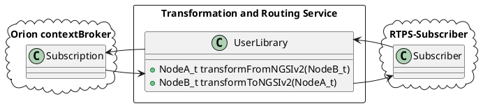

# eProsima Transformation and Routing Service

<!--  -->

*eProsima Transformation and Routing Service* is a library that allows intercommunication between different services and protocols. 
Is an evolution of *eProsima Routing Service* making possible to communicate with no RTPS based protocols, like NGSIv2 from FIWARE-Orion contextBroker.

### Steps to allow other protocols

Taking as example NGSIv2, which is based in RESTful services, it makes evident that we need to allow bidirectional bridges. 
This could be reached with two bridges, one per direction. These bridges are created internally and the user is abstracted to the details.
To achieve this objective, the user is able to specify a library with two tranformation functions, one per each transform required (by each internal bridge), one to transform in one way (for example ROS2 -> NGSIv2) and other to transform in the opposite way (NGSIv2 -> ROS2, in the example).
*Transformation and Routing Service* applies the transform function of the user library received in its subscriber and write the result with its publisher, for each bridge.
In our example with NGSIv2, we want that our bridge tranform the date received from ROS2 and sent it to a RESTful service, **and** received data from subscriptions to that RESTful service, tranform and write it to a publisher of ROS2.

The **config.xml** file must be addapted to each protocol. **RSManager** will parse the correspond node tree depending each protocol, defined in the user library, that knows how to setup each node with the information provided by the xml node.

#### Configuration options in **config.xml**

	<!-- Complete <bridge> node will be sent to each bridge_library to be parsed by itself. -->
	<rs>
		<!-- Generic bridges -->
		<bridge>
			<bridge_type>unidirectional</bridge_type>
			<subscriber> <!-- subscriber node may change depending of bridge_library implementation -->
				<!-- CUSTOM subscriber parameters -->
			</subscriber>
			<publisher> <!-- publisher node may change depending of bridge_library implementation -->
				<!-- CUSTOM publisher parameters -->
			</publisher>
			<transformation>/path/to/transformation/library</transformation> <!-- must define transform function -->
			<bridge_library>/path/to/bridge/library</bridge_library> <!-- must load tranform function as well -->
		</bridge>
		<bridge>
			<bridge_type>bidirectional</bridge_type>
			<nodeA>
				<!-- CUSTOM nodeA parameters -->
			</nodeA>
			<nodeB>
				<!-- CUSTOM nodeB parameters -->
			</nodeB>
			<transformation>/path/to/transformation/library</transformation> <!-- must implement both ways. Bridge_library must know what functions to search -->
			<bridge_library_nodeA>/path/to/bridge/library_1</bridge_library_nodeA> <!-- nodeA -> nodeB logic -->
			<bridge_library_nodeB>/path/to/bridge/library_2</bridge_library_nodeB> <!-- nodeB -> nodeA logic -->
		</bridge>
		<!-- Builtin bridges -->
		<bridge>
			<bridge_type>fastrtps</bridge_type>
			<subscriber>
				<participant>subscriber_participant_name</participant>
				<domain>subscriber_domain</domain>
				<topic>subscriber_topic_name</topic>
				<type>subscriber_type_name</type>
				<partition>subscriber_partition</partition>  <!-- optional -->
			</subscriber>
			<publisher>
				<participant>publisher_participant_name</participant>
				<domain>subscriber_domain</domain>
				<topic>publisher_topic_name</topic>
				<type>publisher_type_name</type>
				<partition>publisher_partition</partition>  <!-- optional -->
			</publisher>
			<transformation>/path/to/transformation/library</transformation>
			<bridge_library>/path/to/bridge/library</bridge_library> <!-- optional -->
		</bridge>
		<bridge>
			<bridge_type>ngsiv2</bridge_type>
			<ros2>
				<participant>ros2_participant_name</participant>
				<domain>0</domain>
				<topic>ros2_topic_name</topic>
				<type>ros2_type_name</type>
				<partition>ros2_partition</partition>
			</ros2>
			<ngsiv2>
				<participant>ngsiv2_participant_name</participant>
				<id>ngsiv2_entity_id</id>
				<host>ngsiv2_host</host>
				<port>ngsiv2_port</port>
				<subscription>
					<type>ngsiv2_entity_type</type> <!-- optional -->
					<attrs>ngsiv2_condition_attrs_list</attrs> <!-- optional, comma separated -->
					<expression>ngsiv2_condition_expression</expression> <!-- optional -->
					<notifs>ngsiv2_notification_attrs_list</notifs> <!-- comma separated -->
					<listener_host>listener_host</listener_host>
					<listener_port>listener_port</listener_port>
					<expiration>ngsiv2_expiration_time</expiration> <!-- optional -->
					<throttling>ngsiv2_throttling</throttling> <!-- optional -->
					<description>ngsiv2_description</description> <!-- optional -->
				</subscription>
			</ngsiv2>
			<transformation>/path/to/transformation/library</transformation>
			<bridge_library_ros2>/path/to/bridge/library_1</bridge_library_ros2>
			<bridge_library_ngsiv2>/path/to/bridge/library_2</bridge_library_ngsiv2>
		</bridge>
	</rs>

In the example *config.xml* above there are defined four bridges, the last two of each currently supported type.

The first bridge type is **unidirectional**, and its behaviour is similar to **fastrtps** bridge that will be described later, but you can specify any publisher/subscriber parameters needed by your bridge implementation.

The second type is **bidirectional**, and again, its behaviour is similar to **ngsiv2** bridge, defined below. In this case, the only restriction is to name each participant as *nodeA* and *nodeB* respectively, as well as *bridge_library_nodeA* and *bridge_library_nodeB*. As in unidirectional case, you can specify any needed parameter for each node by your bridge libraries. The convention of names for the transformation library is responsability of the developer.

The third bridge is of type **fastrtps** (**ros2** can be used too). This bridge allows to communicate different applications that are based on RTPS protocol. In this case each node must be define by their role, **subscriber** or **publisher**:

- **Subscriber** refers to the endpoint that must *subscribe* in our bridge, in other word, the receiver of data of the bridge.

- **Publisher** refers to the endpoint that will *publish* the transformed data.

You can replicate the behaviour of a **fastrtps** bridge with an **unidirectional** bridge with the correct parameters.

If you don't specify any bridge library the system will try to load the default *librsrtpsbridgelib.so* (and a warning will be shown at runtime).
Also, if you don't specify bridge_type, the system will undertand that the bridge is of type **fastrtps**.

The fourth type of bridge is **ngsiv2**. This bridges allows to propagate changes in Orion contextBroker to a RTPS based application and viceversa. Each node is again identified by their protocol:

- **fastrtps** (or **ros2**): RTPS node. Will publish the data using RTPS protocol with data from Orion contextBroker and will update data in contextBroker with data received from RTPS.

- **ngsiv2**: Location of the Orion contextBroker server and parameters for the subscription to the desired changes.

This bridge is a concrete implementation of a **bidirectional** bridge, and again, its behaviour can be replicated with the correct configuration of a bidirectional bridge. A example of NGSIv2 bridge libraries (*librsrtpsngsiv2bridgelib.so* and *libngsiv2rtpsbridge.so*) can be found on [**FIROS2**](https://github.com/eProsima/firos2).
These libraries look for *transformFromNGSIv2* and *transformToNGSIv2* functions in the transformation library.