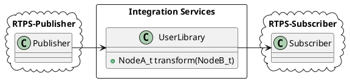
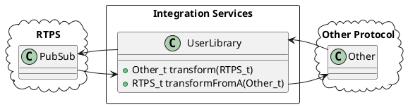

# eProsima Integration Services

<!--  -->

*eProsima Integration Services* is a library and an utility based on *Fast RTPS* for making communication bridges between different systems, services and protocols. With the *Integration Services* the user can create parametric communication bridges between applications. At the same time, it is able to perform some transformations over the messages such as customized routing, mapping between input and output attributes or data modification.

Some of the possibilities offered by the *Integration Services* are:

-   Connections for jumping from topics which are running on different domains.
-   Adapters for mapping the attributes from types with different IDL definitions.
-   User-defined operations over the circulating messages.
-   Communication with others environments, as *ROS2*.

#### Installation

Before compiling *eProsima Integration Services* you need to have installed *Fast RTPS* as described in its [documentation ](http://eprosima-fast-rtps.readthedocs.io/en/latest/binaries.html>). For cloning this project execute:

    $ git clone --recursive https://github.com/eProsima/integration-services

Now, for compiling, if you are on Linux execute:

    $ mkdir build && cd build
    $ cmake ..
    $ make

If you are on Windows choose your version of Visual Studio:

    > mkdir build && cd build
    > cmake ..  -G "Visual Studio 14 2015 Win64"
    > cmake --build .

### Steps to allow other protocols than RTPS

*Integration Services* has a builtin RTPS bridge, but you can specify any other procotol implementing your own libraries. 

There are two kind of libraries that the user can implement:

**Bridge Library**: This library must export the following functions as defined in the *resource/templatebridgelib.cpp* file:

    ISBridge* create_bridge(std::vector<std::pair<std::string, std::string>> *configuration);
    ISSubscriber* create_subscriber(ISBridge* bridge, std::vector<std::pair<std::string, std::string>> *configuration);
    ISPublisher* create_publisher(ISBridge* bridge, std::vector<std::pair<std::string, std::string>> *configuration);
	
The function *create_bridge* must return a pointer to an instance of a derived class of ISBridge, or nullptr if failed. 
The function *create_subscriber* must return a pointer to an instance of a derived class of ISSubscriber, or nullptr if failed. 
The function *create_publisher* must return a pointer to an instance of a derived class of ISPublisher, or nullptr if failed. 
Integration Services will deallocate this object from memory when the bridge is stopped.

Let's take a look to this interfaces:

	/** Base class for publishers. Must know how to write into the destination protocol */
	class ISPublisher
	{
	public:
	    ISPublisher(const std::string &name);
	    virtual ~ISPublisher() = default;
	    virtual bool publish(SerializedPayload_t *data);
	    virtual ISBridge* setBridge(ISBridge *bridge);
	};

	/** Base class for subscribers. Must know how to read from the origin protocol */
	class ISSubscriber
	{
	public:
	    ISSubscriber(const std::string &name);
	    virtual ~ISSubscriber() = default;
	    virtual void addBridge(ISBridge* bridge);
	    virtual void on_received_data(SerializedPayload_t* payload);
	};

	/**
	 * Base class for Bridges. All implementation must inherit from it.
	 */
	class ISBridge
	{
	public:
	    ISBridge(const std::string &name);
	    virtual ~ISBridge();
	    virtual void addSubscriber(ISSubscriber *sub);
	    virtual void addFunction(const std::string &sub, const std::string &fname, userf_t func);
	    virtual void addPublisher(const std::string &sub, const std::string &funcName, ISPublisher* pub);
	    virtual ISPublisher* removePublisher(ISPublisher* pub);
	    virtual void on_received_data(const ISSubscriber *sub, SerializedPayload_t *data);
	    virtual void onTerminate() override;
	};

When implementing your ISBridge derived class, you must take in account:

- Only ISPublisher::publish is mandatory to implement.
- When your subscriber receives data, you must call on_received_data function with the data properly converted into SerializedPayload_t.
- You can override the default behaviour, but isn't recommended in general. This behaviour follows this diagram:

@startuml
hide footbox

participant ISSubscriber
participant ISBridge
participant TransformationLibrary
participant ISPublisher

[-> ISSubscriber : receive

ISSubscriber -> ISSubscriber : on_received_data
ISSubscriber -> ISBridge : on_received_data
ISBridge -> TransformationLibrary : transform
TransformationLibrary --> ISBridge : <<transform_return>>
ISBridge -> ISPublisher : publish

ISPublisher ->] : write
@enduml

When the subscriber calls it self to *on_received_data*, it will call all the *bridges* it belongs, calling the method *on_received_data* of each bridge.
Then the bridges will apply each respective transformation functions to the data and will call the *publish* method of each of their publishers.
All this behaviour will only accors with the declared connectors in the XML configuration file.

**Tranformation Library**: This *optional* library must implement transformation functions for the received data.
This *Transformation Libraries* are indicated in each connector.
The *Bridges* will be provided with the function to call in each case.
There is a prototype in *resource/templatelib.cpp*:

	extern "C" void USER_LIB_EXPORT transform(
		SerializedPayload_t *serialized_input, 
		SerializedPayload_t *serialized_output)

For both types of libraries, there are examples in each example folder of [FIROS2](https://github.com/eProsima/FIROS2/tree/master/examples) project.

May be necessary generate data types from IDL files to communicate with *Fast-RTPS*.

The **config.xml** file must be adapted to each protocol. **ISManager** will provide the parsed *properties* node inside *bridge* node to the *create_bridge* function as a vector of pairs, as defined in the *Bridge Libraries*.

Your custom publisher/subscriber must inherit ISPublisher/ISSubscriber respectively.

How to instantiate your bridge, publisher and/or subscriber is responsability of your *Bridge Library*, but remember that "RTPS" publisher and subscribers will be filled automatically by ISManager with the configuration from the *participant* node of the *config.xml*.

#### Configuration options in **config.xml**

The configuration files defines RTPS *participants*, *bridges* and *connectors*. 
The *participants* can have one or more *endpoints*. *endpoints* can be subscribers or publishers. All this concepts are the same as the ones in Fast-RTPS.
The *bridges* are the defined by the *bridge library* that implements the bridge and the definitions of the subscribers and publishers that we want to instantiate.
Finally, the *conectors* are just relationhips between subscribers and publishers, and optionally, transformation functions.

As reference, let's take this configuration file:

	<is>
	    <participant name="2Dshapes">
		<attributes>
		    <!-- RTPS participant attributes -->
		</attributes>

		<subscriber name="2d_subscriber">
		    <attributes>
					<!-- RTPS subscriber attributes -->
		    </attributes>
		</subscriber>

		<publisher name="2d_publisher">
		    <attributes>
		        <!-- RTPS publisher attributes -->
		    </attributes>
		</publisher>
	    </participant>

	    <participant name="3Dshapes">
		<attributes>
		    <!-- RTPS participant attributes -->
		</attributes>

		<subscriber name="3d_subscriber">
		    <attributes>
					<!-- RTPS subscriber attributes -->
		    </attributes>
		</subscriber>

		<publisher name="3d_publisher">
		    <attributes>
		        <!-- RTPS publisher attributes -->
		    </attributes>
		</publisher>
	    </participant>

	    <bridge name="protocol">
		<library>/path/to/bridge/library/libprotocol.so</library>
		<properties>
		    <property>
		        <name>property1</name>
		        <value>value1</value>
		    </property>
		</properties>

		<publisher name="protocol_publisher">
		    <property>
		        <name>property1</name>
		        <value>value1</value>
		    </property>
		    <property>
		        <name>property2</name>
		        <value>value2</value>
		    </property>
		</publisher>

		<subscriber name="protocol_subscriber">
		    <property>
		        <name>property1</name>
		        <value>value1</value>
		    </property>
		    <property>
		        <name>property2</name>
		        <value>value2</value>
		    </property>
		</subscriber>
	    </bridge>

	    <connector name="shapes_projection">
		<subscriber participant_name="3Dshapes" subscriber_name="3d_subscriber"/>
		<publisher participant_name="2Dshapes" publisher_name="2d_publisher"/>
		<transformation file="/path/to/transform/libuserlib.so" function="transform3D_to_2D"/>
	    </connector>

	    <connector name="shapes_stereo">
		<subscriber participant_name="2Dshapes" subscriber_name="2d_subscriber"/>
		<publisher participant_name="3Dshapes" publisher_name="3d_publisher"/>
		<transformation file="/path/to/transform/libuserlib.so" function="transform2D_to_3D"/>
	    </connector>

	    <connector name="shapes_protocol">
		<subscriber participant_name="2Dshapes" subscriber_name="2d_subscriber"/>
		<publisher participant_name="protocol" publisher_name="protocol_publisher"/>
		<transformation file="/path/to/transform/libprotocoltransf.so" function="transformFrom2D"/>
	    </connector>

	    <connector name="protocol_shapes">
		<subscriber participant_name="protocol" subscriber_name="protocol_subscriber"/>
		<publisher participant_name="2Dshapes" publisher_name="2d_publisher"/>
		<transformation file="/path/to/transform/libprotocoltransf.so" function="transformTo2D"/>
	    </connector>
	</is>

In this file there are defined two RTPS *participants*, and a *bridge*. All of them has a subscriber and a publisher.
There are four connectors defined: *shapes_projection*, *shapes_stereo*, *shapes_protocol* and *protocol_shapes*.

There are several possible types of connections depending of the kind of its participants.

- RTPS Bridge:

In this kind of bridge, both participant are RTPS compliant, like *shapes_projection* and *shapes_stereo* in our example file.

* RTPS -> Other protocol

This connector will communicate a RTPS environment with another protocol. Just like our *shapes_protocol* connector.

Your *Bridge Library* must define at least a publisher to your desired protocol and it is responsible to communicate with it and follow the ISPublisher interface. By default, the transformation function will be applied after the instance of ISBridge is called in the om_received_data method. If you want to change this behaviour you will need to override the complete data flow.

*bridge_configuration* node can contain configuration information that *Bridge Library* must understands. ISManager will parse the *property* nodes of each element and will call the respective *create_* function of the library with a vector of pairs with the data contained.
If no *bridge_configuration* is provided, then your createBridge will be called with nullptr as parameter config.

*transformation* library could be reused by your bridge library, with the same or another transformation function inside the same transformation library (an example of reusing the transformation library can be found on [FIROS2](https://github.com/eProsima/FIROS2/tree/master/examples/TIS_NGSIv2). 
Of course, you can add builted in transformation functions inside your *bridge library*.

* Other procotol -> RTPS

Similar case as the previous one, but in the other way, as in the connector *protocol_shapes* of our example.

The same logic applies in this connectors as in the RTPS -> Other protocol case, but in this case the RTPS participant is the publisher. An example of this can be found on [FIROS2](https://github.com/eProsima/FIROS2/tree/master/examples/helloworld_ros2).

* Bidirectional bridge (RTPS <--> Other protocol)

This case is not a connector, but the consecuence of set two connectors with the correct parameters. In our example the combination of *shapes_projection* and *shapes_stereo* is a bidirectional bridge, as well as, *shapes_protocol* and *protocol_shapes*.

A combination of both logics RTPS->Other and Other->RTPS applies here. The example [TIS_NGSIv2](https://github.com/eProsima/FIROS2/tree/master/examples/TIS_NGSIv2) of FIROS2 uses a bridge of this type.

