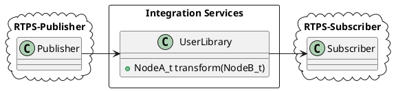
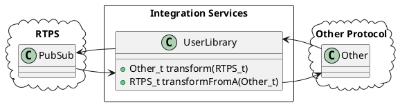

# eProsima Integration Services

<!--  -->

*eProsima Integration Services* is a library and an utility based on *Fast RTPS* for making communication bridges between different systems, services and protocols. With the *Integration Services* the user can create parametric communication bridges between applications. At the same time, it is able to perform some transformations over the messages such as customized routing, mapping between input and output attributes or data modification.

Some of the possibilities offered by the *Integration Services* are:

-   Connections for jumping from topics which are running on different domains.
-   Adapters for mapping the attributes from types with different IDL definitions.
-   User-defined operations over the circulating messages.
-   Communication with others environments, as *ROS2*.

#### Installation

Before compiling *eProsima Integration Services* you need to have installed *Fast RTPS* as described in its [documentation ](http://eprosima-fast-rtps.readthedocs.io/en/latest/binaries.html>). For cloning this project execute:

    $ git clone --recursive https://github.com/eProsima/integration-services

Now, for compiling, if you are on Linux execute:

    $ mkdir build && cd build
    $ cmake ..
    $ make

If you are on Windows choose your version of Visual Studio:

    > mkdir build && cd build
    > cmake ..  -G "Visual Studio 14 2015 Win64"
    > cmake --build .

### Steps to allow other protocols than RTPS

*Integration Services* has a builtin RTPS bridge, but you can specify any other procotol implementing your own libraries. 

There are two kind of libraries that the user must implement:

**Bridge Library**: This library must export *createBridge* function as defined in the *resource/templatebridgelib.cpp* file:

	extern "C" ISBridge* USER_LIB_EXPORT createBridge(const char *config)
	
This function must return a pointer to an instance of a derived class of ISBridge, or nullptr if failed. 
Integration Services will deallocate this object from memory when the bridge is stopped.

Let's take a look to this interfaces:

	/** Base class for publishers. Must know how to write into the destination protocol */
	class ISPublisher
	{
	public:
	    virtual void onTerminate() {}
	    virtual ~ISPublisher() = default;
	    virtual bool publish(void *data) = 0;
	};

	/** Base class for subscribers. Must know how to read from the origin protocol */
	class ISSubscriber
	{
	protected:
	    ISPublisher *listener_publisher;
	public:
	    virtual void onTerminate() {}
	    virtual ~ISSubscriber() = default;
	    virtual bool onDataReceived(void *data) = 0;
	    virtual void setPublisher(ISPublisher* publisher){
		listener_publisher = publisher;
	    }
	};

	/**
	 * Base class for Bridges. All implementation must inherit from it.
	 */
	class ISBridge
	{
	protected:
	    ISPublisher *mp_publisher;
	    ISSubscriber *ms_subscriber;
	    ISPublisher *rtps_publisher;
	    ISSubscriber *rtps_subscriber;
	    //userf_t *transformation;
	public:
	    /**
	     * This method will be called by ISManager when terminating the execution of the bridge.
	     * Any handle, subscription, and resources that the bridge needed to work must be closed.
	     */
	    virtual void onTerminate()
	    {
			if (mp_publisher) { mp_publisher->onTerminate(); }
			if (ms_subscriber) { ms_subscriber->onTerminate(); }
			if (rtps_publisher) { rtps_publisher->onTerminate(); }
			if (rtps_subscriber) { rtps_subscriber->onTerminate(); }
	    }
	    virtual ~ISBridge() = default;
	    virtual ISPublisher* getOtherPublisher() { return mp_publisher; }
	    virtual ISSubscriber* getOtherSubscriber() { return ms_subscriber; }
	    virtual ISPublisher* getRTPSPublisher() { return rtps_publisher; }
	    virtual ISSubscriber* getRTPSSubscriber() { return rtps_subscriber; }
	    virtual void setOtherPublisher(ISPublisher *publisher) { mp_publisher = publisher; }
	    virtual void setOtherSubscriber(ISSubscriber *subscriber) { ms_subscriber = subscriber; }
	    virtual void setRTPSPublisher(ISPublisher *publisher) { rtps_publisher = publisher; }
	    virtual void setRTPSSubscriber(ISSubscriber *subscriber) { rtps_subscriber = subscriber; }
	    //virtual void setTransformation(userf_t *function) { transformation = function; }
	};

When implementing your ISBridge derived class, you must take in account:

- In unidirectional bridges, at least one rtps_publisher or rtps_subscriber must be defined. If both, the bridge will be a RTPS bridge. If only one, the other side must be implemented by a *Bridge Library*

- Except for RTPS bridges, all bridges will work as two bridges, one **rtps_subscriber->mp_publisher** and another **ms_subscriber->rtps_publisher**

**Tranformation Library**: This *optional* library must implement transformation functions for the received data.
If this *Transformation Library* is going to be used for the builtin RTPS subscriber, the name of the function must be **transform**.
If the *Bridge Libraries* will load and call this function, the name of the functions can be customized, and the configuration to load it is responsability of the *Bridge Library*.
There is a prototype in *resource/templatelib.cpp*:

	extern "C" void USER_LIB_EXPORT transform(
		SerializedPayload_t *serialized_input, 
		SerializedPayload_t *serialized_output)

For both types of libraries, there are examples in the *examples* folder and *src/RTPS*.

May be necessary generate data types from IDL files to communicate with *Fast-RTPS*.

*Integration Services* will load the *Bridge Libraries* that can apply the transform function of the *Transformation Library* to the data received in its subscriber and write the result with its publisher, for each bridge.

The **config.xml** file must be adapted to each protocol. **RSManager** will parse the correspond node tree depending each protocol, defined in the *Bridge Libraries*, that knows how to setup each node with the information provided by the xml node.

Your custom publisher/subscriber must inherit ISPublisher/ISSubscriber respectively.

How to instantiate your bridge, publisher and/or subscriber is responsability of your *Bridge Library*, but remember that "RTPS" publisher and subscribers will be filled automatically by ISManager with the configuration from the *config.xml*.

#### Configuration options in **config.xml**

There are several possible types of bridges depending on the configuration file.

- RTPS Bridge:

In this kind of bridge, both participant are RTPS compliant.

	<is>
	    <bridge>
		<bridge_type>unidirectional</bridge_type>
		<subscriber>
		    <!-- RTPS subscriber parameters -->
		</subscriber>
		<publisher>
		    <!-- RTPS publisher parameters -->
		</publisher>
		<transformation>/path/to/transformation/library</transformation> <!-- OPTIONAL, must define transform function -->
	    </bridge>
	</is>

RTPS subscriber/publisher parameters are:

                <participant>participant_name</participant>
                <domain>rtps_domain</domain>
                <topic>rtps_topic</topic>
                <type>data_type</type>
                <partition>rtps_qos_partition</partition> <!-- OPTIONAL -->

* RTPS -> Other protocol

This bridge will communicate a RTPS environment with another protocol.

	<is>
	    <bridge>
		<bridge_type>unidirectional</bridge_type>
		<subscriber>
		    <!-- RTPS subscriber parameters -->
		</subscriber>
		<transformation>/path/to/transformation/library</transformation> <!-- OPTIONAL, must define transform function -->
		<bridge_library>/path/to/bridge/library</bridge_library> <!-- must load tranform function as well -->
		<bridge_configuration>bridge/and/other/configuration</bridge_configuration> <!-- OPTIONAL, Configuration for bridge -->
	    </bridge>
	</is>

Your *Bridge Library* must defina at least a publisher to your desired protocol and it is responsible to communicate with it, respect the ISPublisher interface and apply transformation functions, if needed.

*bridge_configuration* node can contain configuration information that *Bridge Library* must understands. It can be embbeded XML, a path to a configuration file, CSV, etc.
If no *bridge_configuration* is provided, then your createBridge will be called with nullptr as parameter config.

*transformation* library will apply to the RTPS subscriber (and its function must be called **transform**, but could be reused by your bridge library, with the same or another transformation function inside the same transformation library (an example of reusing the transformation library can be found on [FIROS2](https://github.com/eProsima/FIROS2/tree/master/examples/TIS_NGSIv2).

A RTPS subscriber will be added automatically to your bridge by ISManager.

* Other procotol -> RTPS

This bridge will communicate another protocol with a RTPS environment.

	<is>
	    <bridge>
		<bridge_type>unidirectional</bridge_type>
		<publisher>
		    <!-- RTPS publisher parameters -->
		</publisher>
		<bridge_library>/path/to/bridge/library</bridge_library> <!-- must load tranform function as well -->
		<bridge_configuration>bridge/and/other/configuration</bridge_configuration> <!-- Configuration for bridge -->
	    </bridge>
	</is>

Same logic applies in this bridges as in the RTPS -> Other protocol case, but in this case the RTPS participant is the publisher. No transformation library is expected by RTPS side, but in its configuration, the bridge could define a transformation library to apply on the custom subscriber, if needed (an example of this can be found on [FIROS2](https://github.com/eProsima/FIROS2/tree/master/examples/helloworld_ros2).

* Bidirectional bridge (RTPS <--> Other protocol)

In this case, both RTPS publisher and RTPS subscriber must be defined, in addition with the *Bridge LIbrary* that must create a custom publisher and a custom subscriber in the same way that in the types below.

	<is>
	    <bridge>
		<bridge_type>bidirectional</bridge_type>
		<rtps>
		    <subscriber>
		        <!-- RTPS subscriber parameters -->
		    </subscriber>
		    <publisher>
		        <!-- RTPS publisher parameters -->
		    </publisher>
		</rtps>
		<transformation>/path/to/transformation/library</transformation> <!-- must define transform function -->
		<bridge_library>/path/to/bridge/library</bridge_library> <!-- RTPS <-> Other logic -->
		<bridge_configuration>bridge/and/other/configuration</bridge_configuration> <!-- Configuration for bridge -->
	    </bridge>
	</is>

A combination of both logics RTPS->Other and Other->RTPS applies here. The example [TIS_NGSIv2](https://github.com/eProsima/FIROS2/tree/master/examples/TIS_NGSIv2) of FIROS2 uses a bridge of this type.

