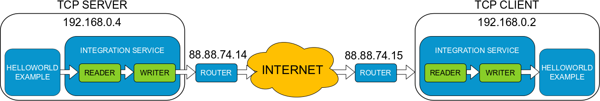

WAN example
-----------

In this example, *IS* will communicate two
`HelloWorldExample <https://github.com/eProsima/Fast-RTPS/tree/master/examples/C%2B%2B/HelloWorldExample>`__
applications running over different subnetworks through a WAN connection. To do that we need at least two
machines that work on different networks and connected to the Internet, and we need to have
Fast-RTPS HelloWorldExample and Integration Service already installed.

Environment
^^^^^^^^^^^

To execute this example, we need to have configured properly two separated subnetworks,
only linked through a WAN connection, ideally the Internet.
We need also to open an input TCP port on the router of the machine that is going to work as a Server,
and establish a port forwarding to route the incoming data of this port the server.

The following diagram shows the minimum architecture of the example that is two machines,
both with a HelloWorld Example running over UDP and one Integration Service operating
as a bridge to connect with the other end. If you want to expand the example you can
run the HelloWorld Example on different machines inside the same LAN than the TCP Server and the TCP Client.

Configuration
^^^^^^^^^^^^^

There are two values that you must set with your own configuration before running the test, the first one is
the Public IP Address of the machine that is going to work as a TCP Server (in the example 88.88.74.14),
and update the XML Files with it.
The **config_server.xml** file has the *wan_addr* inside the transport descriptor.
The **config_client.xml** file has the *address* inside the field *initialPeersList* to set
where it is going to connect.

The second field is the TCP port where the server is going to listen and where the client is going to connect.
By default, this value is 5100, but you can modify this value in the XML configuration
files if you prefer to use other TCP port.

Execution
^^^^^^^^^

To start the example we need to run one HelloWorldExample on each machine, the TCP Server runs a publisher
and the TCP Client runs a subscriber.

*In TCP Server*:

.. code-block:: bash

    cd <HelloWorldExample installation path>
    ./HelloWorldExample publisher

*In TCP Client*:

.. code-block:: bash

    cd <HelloWorldExample installation path>
    ./HelloWorldExample subscriber

Once both HelloWorldExample applications are running no communication should happen as both machines don't belong
to the same subnetwork and UDP traffic should not be possible between them.

To allow communicate the examples, we need to execute *IS* with the proper configuration.

*In TCP Server*:

.. code-block:: bash

    cd <wan_example path>
    integration_service config_server.xml

*In TCP Client*:

.. code-block:: bash

    cd <wan_example path>
    integration_service config_client.xml

In a few seconds, both HelloWorldExample applications will start to communicate.