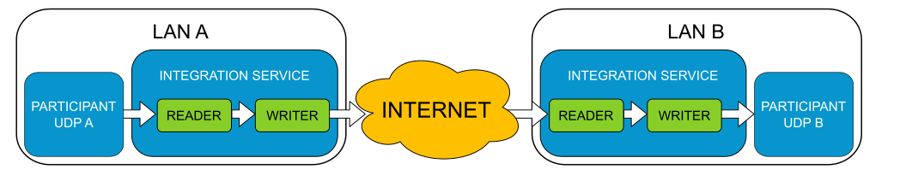

WAN example
-----------

In this example, *IS* will communicate two
`HelloWorldExample <https://github.com/eProsima/Fast-RTPS/tree/master/examples/C%2B%2B/HelloWorldExample>`__
applications running over different subnetworks through a WAN connection.

**Preparation**

To execute this example, we need to have configured properly two separated subnetwork, only linked through a WAN
connection, ideally, internet.

In each subnetwork, we must have a computer with Fast-RTPS HelloWorldExample and Integration Service already installed.

The subnetwork that will receive the incoming connection (that owns the "server" host), should be configured to allow
incoming TCP connections to port 5100 (you can modify this port in the XML configuration files if you prefer
to use other TCP port).

**Execution**

Let's call **Node A** the host that will act as the client and belongs to **LAN A**.
In the same way, **Node B** will be the host that will act as the server and belongs to **LAN B**.

To set up the environment, both "client" and "server" HelloWorldExample must be running.

*In Node A*:

.. code-block:: bash

    cd <HelloWorldExample installation path>
    ./HelloWorldExample subscriber

*In Node B*:

.. code-block:: bash

    cd <HelloWorldExample installation path>
    ./HelloWorldExample publisher

Once both HelloWorldExample applications are running no communication should happen as both machines don't belong
to the same subnetwork and UDP traffic should not be possible between them.

To allow communicate the examples, we need to execute *IS* with the proper configuration.

First, you must edit the file *config_client.xml* and modify the line ``<address>127.0.0.1</address>`` with
**Node B**'s IP address. Save the changes.
Additionally, you can modify the TCP port in both XML files if you need to use another port number instead of 5100.

Now, launch Integration Service in both machines to allow communicating.

*In Node A*:

.. code-block:: bash

    cd <wan_example path>
    integration_service config_client.xml

*In Node B*:

.. code-block:: bash

    cd <wan_example path>
    integration_service config_server.xml

In a few seconds, both HelloWorldExample applications will start to communicate.